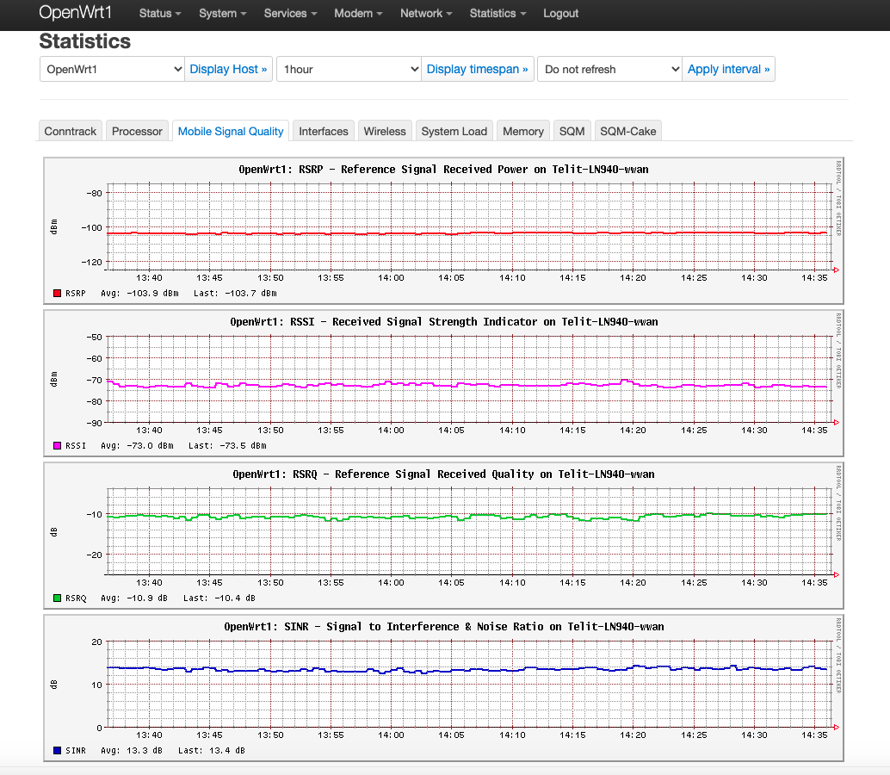

# collectd-Telit-LN940-wwan

This package collects mobile signal statistics with collectd on OpenWrt v21.02. 

## Hardware and Firmware
### Hardware
- Sony NCP-HG100/Cellular
### Firmware
OpenWrt 21.02.1
- nginx
- nginx-mod-luci
- nginx-ssl
- collectd
- collectd-mod-lua
- collectd-mod-nginx
- collectd-mod-rrdtool
- nginx-ssl-util
- nginx-util
- luci-nginx
- luci-app-statistics
- nginx-mod-luci
- uwsgi-luci-support

## Usage
1. Install OpenWrt packages: `collectd-mod-exec`, `collectd-mod-rrdtool`, `flock` and `socat`
2. Put `collect.sh` and `collectd_lte_signal.sh` in `/usr/libexec/collectd/`
3. run `chown nobody:nogroup /usr/libexec/collectd/collect*.sh` and`chmod 500 /usr/libexec/collectd/collect*.sh`
4. Edit `/etc/rc.local`  and add `chmod 666 /dev/ttyUSB2` 
5. Edit `/usr/share/collectd/types.db` and add:
```
mobile_signal_rsrp	value:GAUGE:U:U
mobile_signal_rssi	value:GAUGE:U:U
mobile_signal_rsrq	value:GAUGE:U:U
mobile_signal_sinr	value:GAUGE:U:U
```
2. In the web interface, go to Statistics -> Setup -> General plugins -> Exec
   and add a command. Script is `/usr/libexec/collectd/collect.sh`, user
   is `nobody`, and group is `nogroup`
3. Visualise the data. This can be done by installing the `exec.js` script in
    `/www/luci-static/resources/statistics/rrdtool/definitions/exec.js`

### Screenshot

